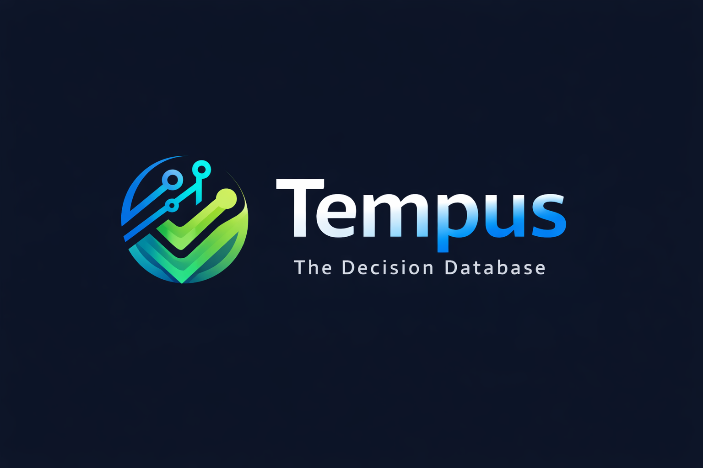

<div align="center">
  

# Tempus DDB

**The B2A security gate for autonomous agent actions**

Local-first · Signed policy · Workload identity · Fail-closed receipts · MCP-native
</div>

> **Status: design-partner beta (`0.4.0`).** Phase 3 policy, identity lifecycle, and
> Vault-backed signing are implemented. Distributed durability and independent external
> checkpoints remain Phase 4 work.
>
> [Roadmap](ROADMAP.md) · [Security](SECURITY.md) ·
> [Threat model](THREAT_MODEL.md) · [Contributing](CONTRIBUTING.md)

Tempus sits between an agent's intent and an external effect. The agent signs what it
wants to do, Tempus issues a short-lived permit, an executor performs the effect, and
the executor plus Tempus sign the outcome. A human is not part of the transaction loop;
humans only inspect the resulting history.

> **Product invariant:** no Tempus permit, no effect; every effect produces a verifiable
> receipt.

The `0.4.0` source tree implements the complete local permit protocol, signed policy
bundles, rotation and revocation, a generic mediated executor, Vault Transit signing,
and a packaged credential-isolated GitHub REST adapter. It does **not** yet include
distributed permit consumption, external checkpoints, or a web audit console. See
[B2A_IMPLEMENTATION_PLAN.md](B2A_IMPLEMENTATION_PLAN.md)
and [THREAT_MODEL.md](THREAT_MODEL.md) for the exact boundary.

## What is implemented

- Stable machine contracts with explicit `schema_version` values.
- Separate Ed25519 identities for the Tempus gate, requesting agent, and executor.
- Immutable, gate-signed agent registration receipts. Registrations cannot be silently
  overwritten.
- Signed, versioned deterministic policy bundles. Each permit binds its policy digest,
  reproducible evidence digest, closed reason codes, and executor constraints.
- Tenant-scoped delegation, signed key rotation and revocation, historical key-at-time
  verification, and emergency invalidation of unconsumed permits.
- A provider-neutral signer boundary shared by the gate and executor. Local Ed25519 and
  Vault Transit use the same exact-byte contract; provider outages fail closed.
- `ALLOWED` or `BLOCKED` authorization before execution.
- Short-lived permits, deterministic action IDs, and idempotency conflict detection.
- Single-consumption execution receipts; an identical retry is idempotent and a
  conflicting second outcome is rejected.
- End-to-end verification of intent, gate authorization, executor outcome, and receipt
  linkage.
- A generic `TempusExecutor` that verifies gate identity, tenant, expiry, permit
  integrity, and single consumption before a demo adapter produces an effect.
- Signed executor observations for `STARTED`, `SUCCEEDED`, `FAILED`, and `UNKNOWN`, with
  restart recovery that never retries an ambiguous external effect.
- A packaged GitHub executor for `github.create_issue` and
  `github.create_pull_request`; it binds the exact repository and allowlisted arguments
  from the signed intent and keeps `GITHUB_TOKEN` outside the agent payload.
- Money is optional metadata in the same universal action envelope; financial and
  non-financial actions use the same protocol.
- An autonomous MCP surface that hides administrative, legacy, and destructive tools by
  default.

## B2A flow

```text
agent signs intent
        │
        ▼
Tempus request_action ── BLOCKED ──► signed denial trace
        │ ALLOWED
        ▼
single-use, expiring permit
        │
        ▼
executor performs effect and signs outcome
        │
        ▼
Tempus commit_outcome ──► final signed execution receipt
        │
        ▼
human or machine calls verify_trace
```

Tempus becomes an unavoidable toll when the executor exclusively holds the downstream
credential. The packaged GitHub adapter implements that boundary for its supported
actions in a single-instance deployment. Operators must ensure the requesting agent
cannot read the executor's environment or key material.

## Install

Python 3.10 or newer is required.

```bash
pip install tempus-ddb
```

Development checkout:

```bash
python -m pip install -e .
```

## Bootstrap identities

`tempus init` creates the local gate key and database, then records the gate as the
signed delegation root. This is deployment-time bootstrap, not a human approval step
for each action.

```bash
tempus init
tempus keygen --output agent.keys.json
tempus keygen --output executor.keys.json

tempus register-agent --alias purchasing-agent --agent-keyfile agent.keys.json \
  --metadata '{"tenant_id":"acme"}'
tempus register-agent --alias purchasing-executor --agent-keyfile executor.keys.json \
  --metadata '{"tenant_id":"acme"}'
tempus doctor --json
tempus conformance --signer
```

The gate signer configuration is the global `--keyfile` and defaults to `keys.json`.
Production deployments should use the non-secret Vault Transit configuration described
in [docs/VAULT_TRANSIT_SIGNER.md](docs/VAULT_TRANSIT_SIGNER.md); the workload authenticates
to Vault without placing a private key in the file.

## Install a production policy

Bootstrap installs a signed compatibility baseline so the first local flow works; it is
not a production allowlist. Before a production effect, copy
`config/policy.github.example.json`, replace the repository scope
and executor public key, then install it. A new policy version retires the previous active
policy for the same tenant without deleting historical bundles.

```bash
tempus install-policy --policy acme-github-policy.json
tempus list-policies
```

Policy evaluation is deterministic and rejects unknown constraints, floating-point input,
oversized input, tenant/resource/action mismatches, excessive TTL, disallowed executors,
and money metadata outside the configured currency or minor-unit ceiling.

## Python quickstart

```python
import json
import time
from tempus_ddb import TempusDDB, gen_keys

gen_keys("gate.keys.json")
gen_keys("agent.keys.json")
gen_keys("executor.keys.json")

gate = TempusDDB("tempus.db", "gate.keys.json")

with open("gate.keys.json", encoding="utf-8") as handle:
    gate_id = json.load(handle)["public_key"]
with open("agent.keys.json", encoding="utf-8") as handle:
    agent_id = json.load(handle)["public_key"]
with open("executor.keys.json", encoding="utf-8") as handle:
    executor_id = json.load(handle)["public_key"]

gate.register_agent(gate_id, "tempus-gate", '{"can_delegate":true}')
gate.register_agent(agent_id, "purchasing-agent", "{}")
gate.register_agent(executor_id, "purchasing-executor", "{}")

intent = json.dumps({
    "schema_version": "tempus.action-intent.v1",
    "tenant_id": "acme",
    "agent_id": agent_id,
    "idempotency_key": "purchase-2026-07-16-001",
    "action_type": "purchase",
    "resource": "vendor-api/compute-credits",
    "requested_at": time.time_ns() // 1_000,
    "input": {"sku": "compute-credits"},
    "money": {"amount": "25.00", "asset": "USD", "beneficiary": "vendor-42"},
})

authorization = json.loads(gate.request_action(intent, "agent.keys.json", 60))
permit = authorization["authorization"]
assert permit["decision"] == "ALLOWED"

# The executor performs the external effect only after checking the permit.
outcome = json.dumps({
    "schema_version": "tempus.action-outcome.v1",
    "authorization_id": permit["authorization_id"],
    "action_id": permit["action_id"],
    "status": "SUCCEEDED",
    "external_reference": "vendor-tx-9182",
    "output": {"credits_added": 1000},
})

receipt = gate.commit_outcome(
    permit["authorization_id"],
    outcome,
    "executor.keys.json",
)
verification = json.loads(gate.verify_trace(permit["action_id"]))
assert verification["status"] == "VERIFIED"
assert verification["phase"] == "COMPLETED"
```

For remote transports, use `request_action_signed(...)` and
`commit_outcome_signed(...)`. The requesting agent and executor sign locally, so their
private keys and keyfiles never enter the gate process.

## Demos and Scenarios

The repository includes runnable end-to-end demonstrations covering security guards, B2A flow, and tamper detection:
Examples create ephemeral databases and keys and remove them when they finish.

### 1. Commercial Demo (`commercial_demo.py`)
Demonstrates the Phase 2 mediated-executor foundation and bypass prevention against a
simulated downstream API.
```bash
python commercial_demo.py
```
**Key checks performed:**
- **Direct Bypass Attempt:** Rejected (agent lacks downstream API secret token).
- **Authorized Execution:** Agent signs intent &rarr; Tempus Gate validates &rarr; Mediated Executor verifies permit &rarr; API executed.
- **Replay Guard:** Re-using a consumed permit is rejected by the Executor.
- **Expiry Guard:** Expired permits are rejected.
- **Tamper Guard:** Altered permit fields invalidate the signature and are rejected.
- **Cross-Tenant Guard:** Permits issued for a different tenant ID are blocked.
- **Trace Verification:** Full cryptographic audit trace verification passes end-to-end.

### 2. Decision Chain Scenario (`demo_scenario.py`)
Simulates an autonomous bot lifecycle (Genesis &rarr; Decision 1 &rarr; Decision 2) with chain validation and JSON export:
```bash
python demo_scenario.py
```

### 3. CLI Tamper Detection (`tamper_demo_rust_cli.py`)
Demonstrates tamper detection using the Rust CLI by simulating unauthorized modifications to recorded traces:
```bash
python tamper_demo_rust_cli.py
```

### 4. Code Examples (`examples/`)
Additional standalone scripts in `examples/`:
- `examples/basic_record.py`: Basic decision recording.
- `examples/full_agent_flow.py`: Complete multi-agent authorization flow.
- `examples/verify_chain.py`: Cryptographic chain verification.

```bash
python examples/full_agent_flow.py
```

## GitHub executor

The installed `tempus-github-executor` command performs real GitHub REST writes for two
exact action types:

- `github.create_issue`, with `resource` set to `owner/repository` and allowlisted
  `title`, `body`, and `labels` input fields.
- `github.create_pull_request`, with `resource` set to `owner/repository` and
  allowlisted `title`, `head`, `base`, `body`, and `draft` input fields.

The executor reads `GITHUB_TOKEN` from its own environment. Do not put that variable in
the requesting agent's environment or include credentials in an intent.

```powershell
$env:GITHUB_TOKEN = '<executor-only token>'
tempus-github-executor `
  --permit permit.json `
  --executor-db github-executor.db `
  --executor-keyfile executor.keys.json `
  --gate-id <gate-public-key> `
  --tenant-id acme
```

The command emits a signed `tempus.action-outcome.v1`. Submit it to the gate through
`commit_outcome_signed(...)` or `tempus_commit_outcome_signed`. Exit code `2` means the
external result is `UNKNOWN`; the signed observation must be investigated and the
operation must not be retried automatically.

## Performance Benchmarks

Tempus DDB includes a benchmarking tool to evaluate transaction throughput and validation latency:

```bash
python benchmark.py --records 1000
```

To output machine-readable JSON:
```bash
python benchmark.py --records 1000 --json
```

**Optimizations active in v0.2.1+:**
- SQLite Write-Ahead Logging (`WAL` mode) with `PRAGMA synchronous = NORMAL` and `busy_timeout = 5000`.
- In-memory key caching to prevent disk I/O bottlenecks during hot-path transactions.
- Max LTO release compilation (`opt-level = 3`, `lto = true`, `codegen-units = 1`).

## Stable contracts

| Contract | Schema |
|---|---|
| Agent intent | `tempus.action-intent.v1` |
| Authorization response | `tempus.authorization-result.v1` |
| Signed permit | `tempus.authorization-receipt.v1` |
| Signed deterministic policy | `tempus.policy-bundle.v1` |
| Policy evidence | `tempus.policy-evidence.v1` |
| Identity lifecycle event | `tempus.identity-lifecycle-event.v1` |
| Executor outcome | `tempus.action-outcome.v1` |
| Execution response | `tempus.execution-result.v1` |
| Signed execution receipt | `tempus.execution-receipt.v1` |
| Executor state observation | `tempus.executor-observation.v1` |
| Complete trace | `tempus.action-trace.v1` |
| Verification result | `tempus.trace-verification.v1` |

Authorization decisions are `ALLOWED` or `BLOCKED`. Execution outcomes are `SUCCEEDED`
or `FAILED`. Executor observations are `STARTED`, `SUCCEEDED`, `FAILED`, or `UNKNOWN`.
Trace verification is `VERIFIED` or `INVALID`.

Phase 3 fields are additive to the v1 authorization contracts. Executors require and
verify them, while historical Phase 2 receipts keep their original signature semantics.
See [COMPATIBILITY.md](COMPATIBILITY.md) for support/deprecation rules and
[MIGRATION_0.4.md](MIGRATION_0.4.md) for the `0.3.x` upgrade procedure.

## MCP autonomous mode

The default MCP surface exposes only machine-to-machine execution and read-only audit
operations. The agent and executor must sign their own payloads; the gate never receives
their keyfile paths:

| Tool | Purpose |
|---|---|
| `tempus_request_action_signed` | Verify a locally signed intent and obtain a signed, expiring permit |
| `tempus_commit_outcome_signed` | Consume a permit with an executor-signed result |
| `tempus_get_trace` | Read authorization and execution evidence |
| `tempus_verify_trace` | Verify the complete action trace |
| `tempus_list_agents` | Read signed agent identities |
| `tempus_list_policies` | Read active and retired signed policy bundles |
| `tempus_list_identity_events` | Read signed rotation and revocation events |

Configuration:

```json
{
  "mcpServers": {
    "tempus": {
      "command": "tempus",
      "args": ["mcp", "start"],
      "env": {
        "TEMPUS_MODE": "autonomous",
        "TEMPUS_GATE_KEYFILE": "keys.json"
      }
    }
  }
}
```

Provisioning should run separately from the agent-facing MCP process. The following
flags are deliberately off by default:

| Flag | Unlocks |
|---|---|
| `TEMPUS_ADMIN_TOOLS=1` | init, key generation, signed agent registration, whoami |
| `TEMPUS_LEGACY_TOOLS=1` | old voluntary `record`, list, export, count, validate tools |
| `TEMPUS_DESTRUCTIVE_TOOLS=1` | demo-only cleanup |
| `TEMPUS_LOCAL_KEYFILE_TOOLS=1` | development-only `tempus_request_action` and `tempus_commit_outcome` tools that accept local keyfile paths |

## Human audit

Humans are readers, not approvers:

```bash
tempus trace --action-id <action-id>
tempus verify-trace --action-id <action-id>
tempus list-agents
tempus list-policies
tempus identity-events
```

The future audit console will be read-only and derive its views from these contracts.

## Legacy ledger

The original `record`, `validate`, `list`, `count`, and `export` interfaces remain for
compatibility and migration. They are a voluntary flight recorder and do not enforce
the B2A toll. New autonomous integrations should use the signed action authorization
flow; local keyfile MCP tools are development compatibility only.

## Security boundary

This implementation detects receipt, policy, evidence, and trace alteration; rejects
unregistered or revoked actors; prevents conflicting idempotent requests; and prevents
two outcomes from consuming one permit. It does not yet prevent deletion or rollback of
the entire local database, nor bypass by an agent that still possesses downstream
credentials. Read [THREAT_MODEL.md](THREAT_MODEL.md)
before using Tempus for high-impact production actions.

## Roadmap and adoption

Phase 2 is complete for the single-instance GitHub adapter and Phase 3 is implemented in
the `0.4.0` source tree. Hosted CI and live credentialed Vault/GitHub checks are deferred
while the repository runner has a billing restriction; local tests remain the recorded
validation source. Phase 4 is durable distributed receipts and independent rollback
detection. The adoption track focuses on design partners, a short GitHub onboarding path,
and measurable time-to-first-verified-effect. See
[ROADMAP.md](ROADMAP.md) for ordered milestones and release gates.

## Development

See [CONTRIBUTING.md](CONTRIBUTING.md) for setup, security reporting, and pull-request
requirements. The complete local verification set is:

```bash
cargo fmt --check
cargo clippy --all-targets -- -D warnings
cargo test --all-targets
ruff check .
pytest -p no:cacheprovider
python -m maturin build
```

## License

MIT. See [LICENSE](LICENSE).
